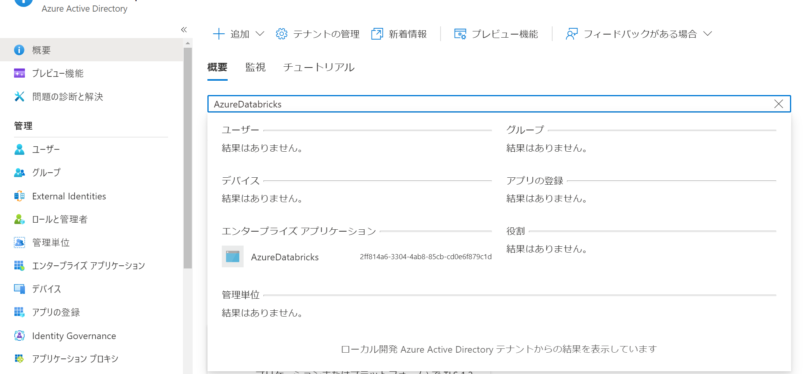
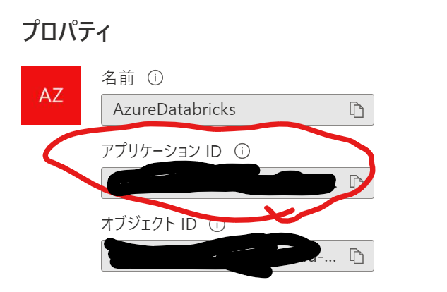
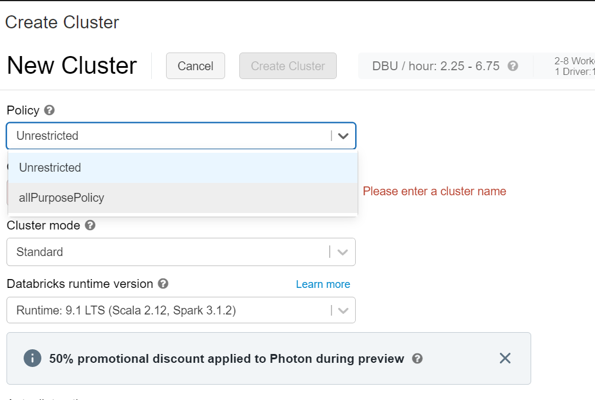
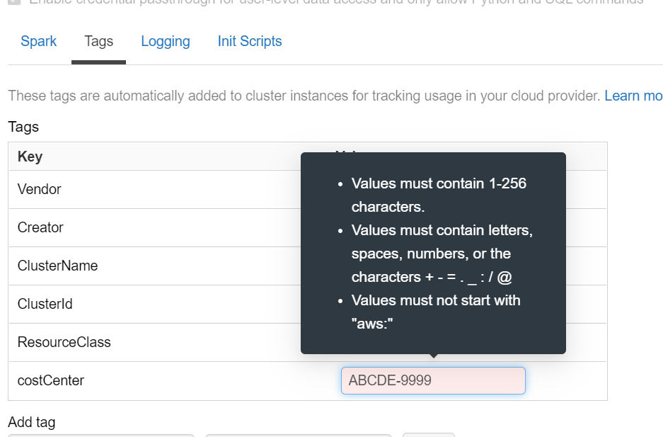
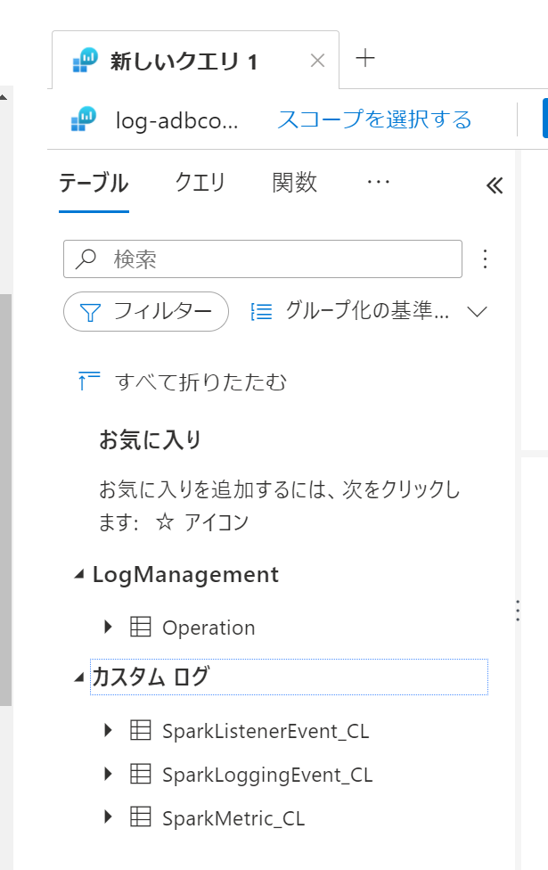

# Databricksの外部メタストアとlog Analytics連携の検証環境

## アーキテクチャ


- LogAnalytics用サービス
  - Log Analytics Workspace:ログ蓄積
  - Key Vault:Log Analytics ID,Key保管
- 外部Hiveメタストア用サービス
  - Azure SQL:メタストア用DB
  - Key Vault:Azure SQL ID,Password,JDBC接続文字列保管
- Databricks Workspace 001,002:メタストアの動機確認用に2ワークスペース構成

## 注意事項

- SQL Databaseのネットワーク制限を排除しています。
- その他セキュリティ関連の設定はできるだけ疎通をしやすくしています。

## 前提条件

- Azure サブスクリプションに対する所有者権限
- docker
  - VSCode Remote Container環境
  - - [WSL 開発環境を設定するためのベスト プラクティス](https://docs.microsoft.com/ja-jp/windows/wsl/setup/environment) を参照して環境をセットアップしてください。「Docker を使用してリモート開発コンテナーを設定する」まで実行すればOKです。

## 手順

### 1. 本リポジトリをgit cloneか、ZIPダウンロードし、フォルダをVSCodeで開きます。

### 2. 変数情報の設定

「.devcontainer」フォルダ内の 「envtemplate」を「devcontainer.env」に名前変更して、内容を更新します。

#### databricksIdの確認方法

1. Azure ADで「AzureDatabricks」で検索



2. アプリケーションIDをコピー


### 3. Remote-Containerの起動

「Ctrl + Shigt + P」より、「Open Folder in Conteiner」を選択して、コンテナを起動します。

### 4. deply.shの実行

ターミナルを起動して、以下を実行します。

```BASH

bash deploy.sh

```

### 5. メタストア用のSQLを実行する

Azure SQL に接続し、以下のスクリプト内のsqlをすべて実行します。

./iac/code/databricks/externalMetastore/hive-schema-2.3.0.mssql.sql

## 確認内容

### 1. Hive Metastoreの同期

クラスタを作成する際にクラスターポリシーを設定します。



コストセンタータグを入力してください。※大文字英語5文字-数字5桁のルールになっています。



任意のワークスペースで、データベースかテーブルを作成し、他方のワークスペースで「Data」タブに反映されていることを確認します。


### 2. Log Analytics連携

Log Analyticsにアクセスし、spark関連のテーブルが作成されていることを確認します。

※クラスターを作成するまでテーブルは作成されません。



## 参考

- https://docs.microsoft.com/ja-jp/azure/databricks/data/metastores/external-hive-metastore
- https://docs.microsoft.com/ja-jp/azure/architecture/databricks-monitoring/configure-cluster
- https://github.com/mspnp/spark-monitoring
- https://qiita.com/whata/items/b862cb9f2a641613f347
- https://qiita.com/manabian/items/a84538f3a82df3af39c3
- https://qiita.com/manabian/items/61a987aa7f9889280a42

